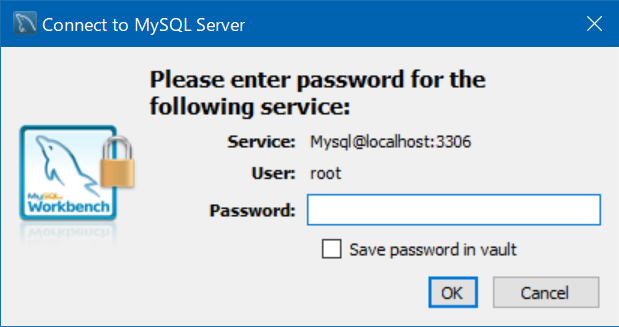
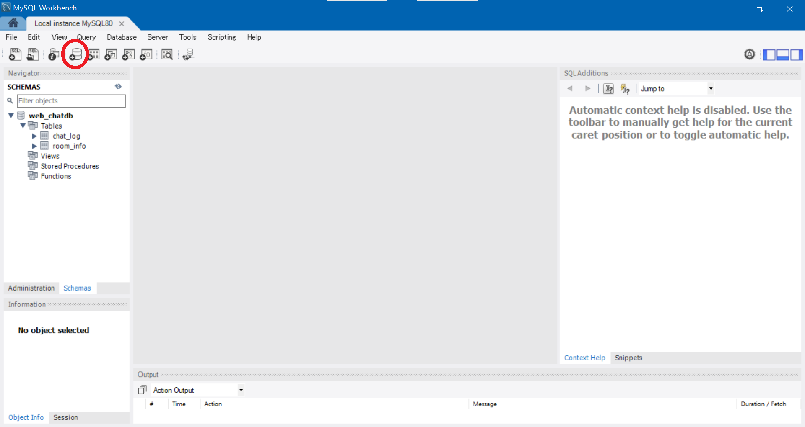
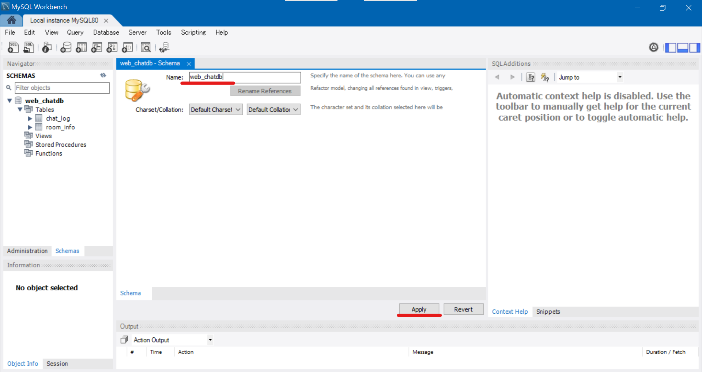
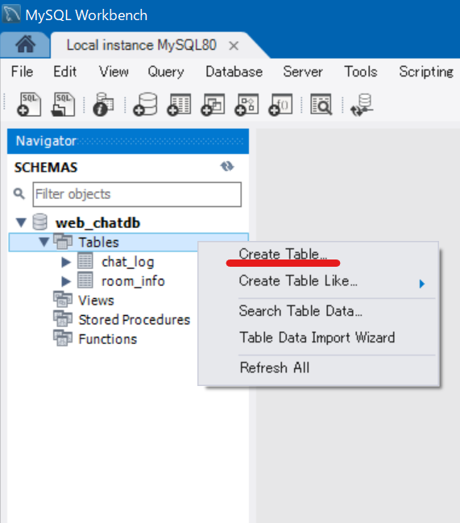
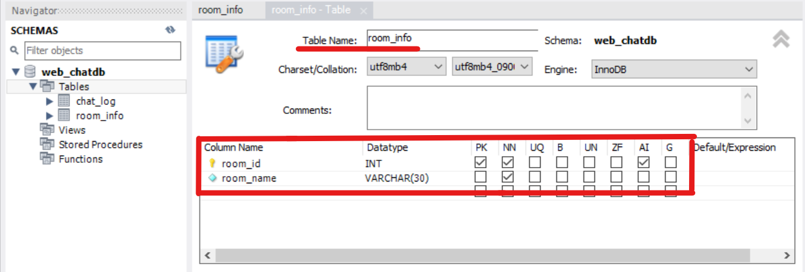
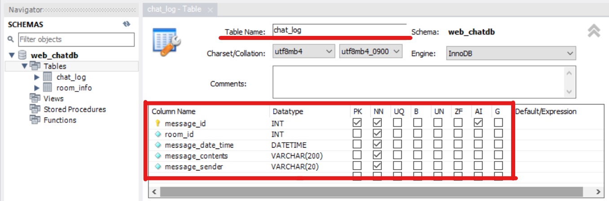

# web_chat_app
選択したルーム内でチャットができるウェブアプリケーション。

# Installation & Setting
1. 以下のリンクからNode.jsとMySQLをダウンロード、インストールしてください。 
Node.js: https://nodejs.org/ja/download/current/ 
MySQL  : https://www.mysql.com/jp/

2. インストールが完了しましたら、MySQL Workbench8.0を開きます。 
    （デフォルトでは C:\Program Files\MySQL にあります。）

3. MySQLWorkbench.exeを起動します。

4. MySQL ConnectionsにあるLocal instance MySQL80というコネクションをクリックします。 
  
    passwordの入力を求められますので、インストール時に設定したパスワードを入力してください。
  

5. タブの下にあるアイコンで、左から4つ目のアイコンをクリックしてください。
  

6. 「web_chatdb」という名前に書き換えて、Applyボタンをクリックしてください。 
  
    左のSCHEMAS欄にweb_chatdbが表示されます。

7.  web_chatdbを開き、Tablesを左クリックしてCreate tableをクリックしてください。
  

8.  テーブル名を「room_info」として、下画像のようにカラムを追加してください。
  

9. 7~8と同様の手順で「chat_log」テーブルも作成します。
  

# Note
注意点などがあれば書く

# Author
* 藤田留衣
